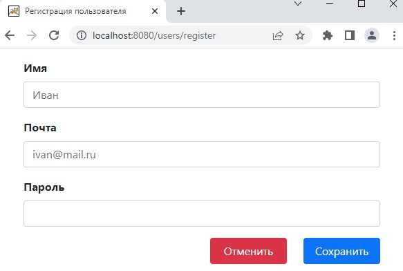
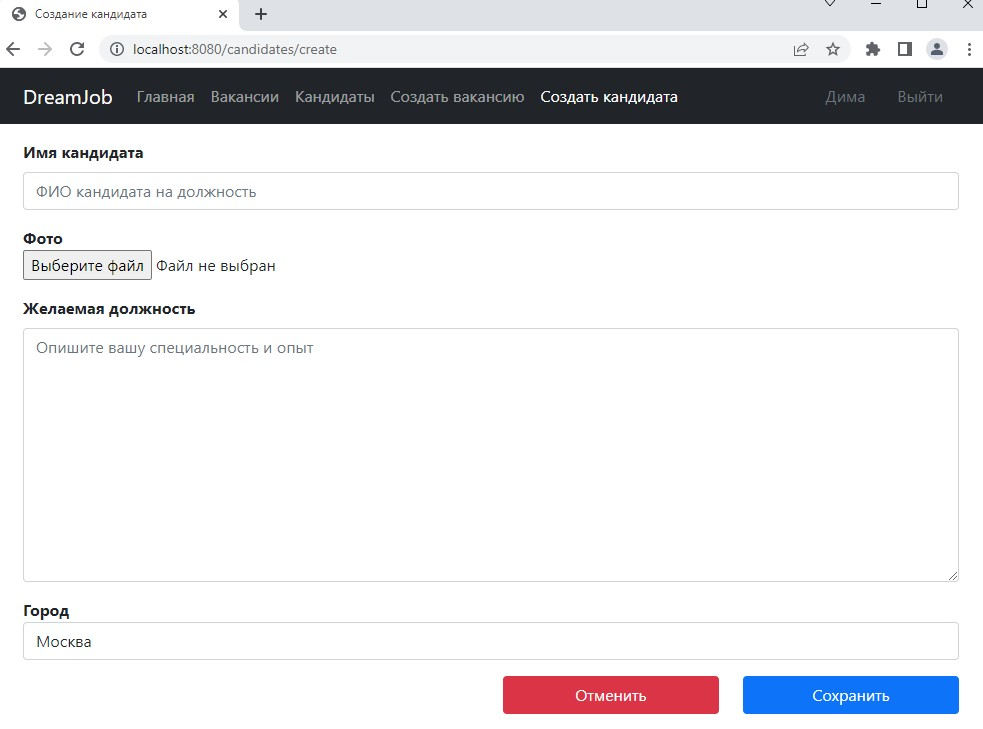

Проект "Работа мечты"

Описание проекта
Приложение представляет сайт по размещению вакансий с предложением трудоустройства,
а также резюме кандидатов на различные должности для работодателя.
Вакансия состоит из названия, описания, логотипа компании, города размещения,
и признака размещена вакансия или нет.
Резюме кандидата состоит из имени кандидатов, описания желаемой должности,
фото кандидата и города проживания.
Так же реализована страница регистрация пользователей в системе и последующая их авторизация.
Все функции приложения доступны только зарегистрированным пользователям.

Стек технологий

Java 17
PostgreSQL 14
Spring BOOT 2.7.4
Liqubase 4.15
Sql2o 1.6
Bootstrap 5.0.2
Thymeleaf 3.1

Требования к окружению
Java 17, Maven 3.9.5, PostgreSQL 12.

Запуск приложения

Создайте базу данных my_dreamjob при помощи консоли PostgreSQL или терминала pgAdmin:
"""CREATE DATABASE my_dreamjob"""
Скопировать проект из репозитория по ссылке: Проект работа мечты
Перейдите в корень проекта и при помощи Maven соберите проект командой:
"""mvn install -Pproduction -Dmaven.test.skip=true"""
После успешной сборки проекта перейдите в каталог собранного проекта target и запустите приложение командой:
"""java -jar my_dreamjob-1.0-snapshot.jar"""
В браузере перейдите по ссылке http://localhost:8080/index

Взаимодействие с приложением

Рисунок 1. Авторизация пользователя.

Рисунок 2. Регистрация пользователя.

Рисунок 3. Главная страница.

Рисунок 4. Список всех вакансий.

Рисунок 5. Список всех кандидатов.

Рисунок 6. Создание новой вакансии.

Рисунок 7. Создание нового кандидата.

Рисунок 8. Редактирование вакансии.

Рисунок 9. Редактирование кандидата.

Рисунок 10. Страница ошибки.

